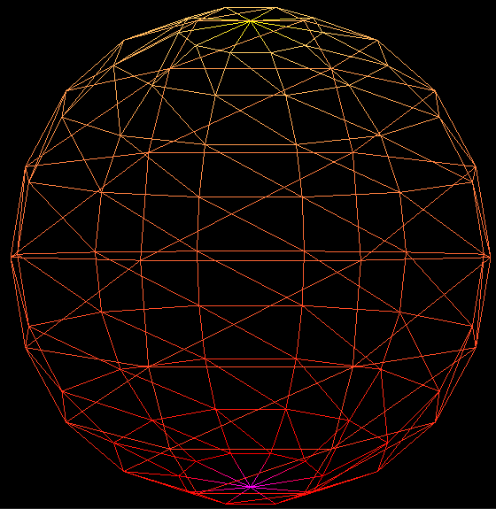
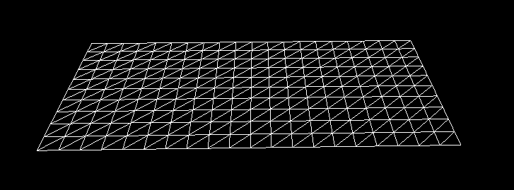
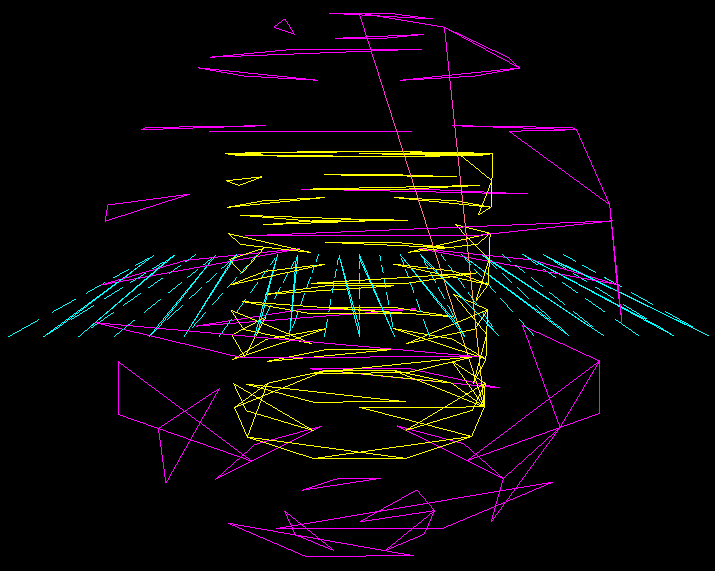
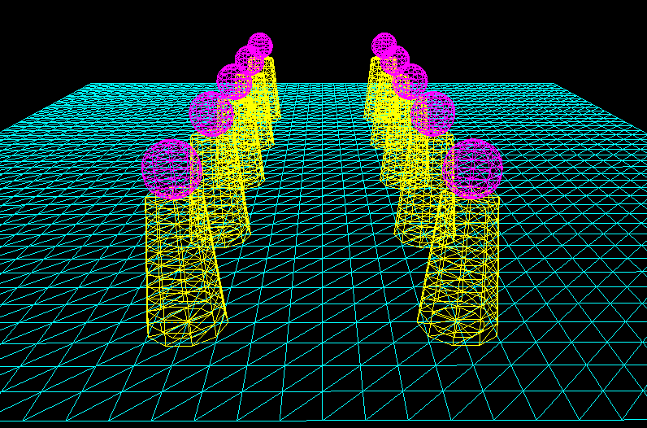
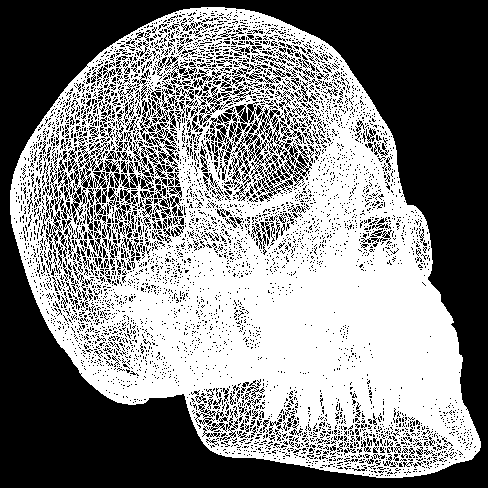

# 学习SharpDX的笔记
存储用SharpDX学习DirectX11过程的代码，从龙书11的*6.3 INDICES AND INDEX BUFFERS*一节开始记录的~ （虽然题目是SharpDX，因为书都是cpp，代码都是cpp，自行寻找对应的wrap版本）

## 6.5 常量缓冲区
在着色器*MyShader.fx*中，定义了cbuffer结构的一个实例——cbPerObject。该常量缓冲区中存储了一个矩阵，其能将点从局部空间变换到齐次裁剪空间中。通过effects框架，可以在运行阶段改变缓冲区中的内容。这提供了代码和着色器之间的通信方法。
```HLSL
cbuffer cbPerObject {
	float4x4 worldViewProj;
};
```
对不同的物体，其世界矩阵world不一样，因此worldViewProj也都各不相同。但是View，Proj矩阵都一样。因此有必要将缓冲区按照更新频率分开。如下分成了三个不同的区域，每物体、每帧、几乎不更新：
```HLSL
cbuffer cbPerObject
{
	float4x4 gWVP;
};
cbuffer cbPerFrame
{
	float3 gLightDirection;
	float3 gLightPosition;
	float3 gLightColor;
};
cbuffer cbRarely
{
	float4 gFogColor;
	float gFogStart;
	float gFogEnd;
};
```
## 6.7 渲染状态
D3D有一些状态组合可以来对其进行配置。
- D3D11RasterizerState:配置渲染管线光栅化阶段。
- D3D11BlendState:混合(blend)
- D3D11DepthStencilState:深度测试和模板测试相关状态配置。默认状态下模板测试禁用。深度测试为标准。

使用DepthStencilState，需要先创建一个描述结构体：

```cpp
typedef struct D3D11_RASTERIZER_DESC {
	D3D11_FILL_MODE FillMode;	// Default: D3D11_FILL_SOLID
	D3D11_CULL_MODE CullMode;	// Default: D3D11_CULL_BACK
	BOOL FrontCounterClockwise;	// Default: false
	INT DepthBias;			// Default: 0
	FLOAT DepthBiasClamp;		// Default: 0.0f
	FLOAT SlopeScaledDepthBias;	// Default: 0.0f
	BOOL DepthClipEnable;		// Default: true
	BOOL ScissorEnable;		// Default: false
	BOOL MultisampleEnable;		// Default: false
	BOOL AntialiasedLineEnable;	// Default: false
} D3D11_RASTERIZER_DESC;
```
其中重要的有：
- FillMode:线框还是固体
- CullMode:背面消隐
- FrontCounterClockwise:指定顺时针/逆时针正反向的

用`CreateRasterizerState()`创建光栅化状态，返回的对象之后调用`RSSetState()`设置即可。

注意：程序中需要多个状态时，都要在初始化阶段声明并创建好State对象。使用时直接调用。推荐将它们放在一个静态类中。

此外，每一个状态都是有默认值，通过`RSSetState(0)`可以将状态恢复到默认。

## 6.8 Effect框架
文件结构：一个*effect*至少包含一个*technique*，一个*technique*最少包含一个*pass*。

一个*pass*包含一个顶点着色器、几何着色器[可选]、曲面细分[可选]、像素着色器、渲染状态。

SharpDX中使用Effect需要安装多余的扩展：*SharpDX.Direct3D11.Effects*

PS:命名变量的时候添加后缀指明所在空间：

- L: Local Space
- W: World Space
- V: View Space
- H: Homogeneous clip Space

下面代码声明了一个RS状态，一个tech，一个pass。其中在pass中设置顶点和像素着色器以及设置RS状态。

```fx
RasterizerState WireFrameRS
{
	FillMode = Wireframe;
	CullMode = Back;
	FrontCounterClockwise = false;
};

technique11 ColorTech
{
	pass P0
	{
		SetVertexShader(CompileShader(vs_5_0, VS()));
		SetPixelShader(CompileShader(ps_5_0, PS()));
		SetRasterizerState(WireFrameRS);
	}
}
```

接下来通过`CompileFromFile()`编译文件，接下来通过`CreateEffectFromMemory()`根据二进制码在程序中创建Effect框架。

```
HRESULT D3DX11CompileFromFile(
	LPCTSTR pSrcFile,
	CONST D3D10_SHADER_MACRO *pDefines,
	LPD3D10INCLUDE pInclude,
	LPCSTR pFunctionName,
	LPCSTR pProfile,
	UINT Flags1,
	UINT Flags2,
	ID3DX11ThreadPump *pPump,
	ID3D10Blob **ppShader,
	ID3D10Blob **ppErrorMsgs,
	HRESULT *pHResult
);
```
|参数|作用|
|:---:|:---:|
|pSrcFile|文件名|
|pProfile|着色器版本，"fx_5_0"|
```
HRESULT D3DX11CreateEffectFromMemory(
	void *pData,
	SIZE_T DataLength,
	UINT FXFlags,
	ID3D11Device *pDevice,
	ID3DX11Effect **ppEffect
);
```
|参数|作用|
|:---:|:---:|
|pDevice|设备指针|
|ppEffect|创建的Effect指针|

注意：在SharpDX中，使用`SharpDX.D3DCompiler.CompileFromFile()`编译着色器，使用`SharpDX.Direct3D11.Effects`类进行创建。如：

```csharp
using (var effectByteCode = ShaderBytecode.CompileFromFile("../../MyShader.fx","fx_5_0")) {
	var effect = new Effect(_d3DDevice, effectByteCode);
}
```

运行过程会报错：缺少"sharpdx_direct3d11_1_effects_x86.dll"文件，这是因为版本问题，将nuget安装的包中"sharpdx_direct3d11_1_effects.dll"复制并重命名到执行目录中即可。

### 6.8.3 程序与Effect交互
如effect中包含下述缓冲区数据：
```cpp
cbuffer cbPerObject
{
	float4x4 gWVP;
	float4 gColor;
	float gSize;
	int gIndex;
	bool gOptionOn;
};
```
通过`GetVariableByName()`等方法获得`EffectVariable`类型的数据。
```cpp
ID3DX11EffectMatrixVariable* fxWVPVar;
ID3DX11EffectVectorVariable* fxColorVar;
ID3DX11EffectScalarVariable* fxSizeVar;
ID3DX11EffectScalarVariable* fxIndexVar;
ID3DX11EffectScalarVariable* fxOptionOnVar;
fxWVPVar = mFX->GetVariableByName("gWVP")->AsMatrix();
fxColorVar = mFX->GetVariableByName("gColor")->AsVector();
fxSizeVar = mFX->GetVariableByName("gSize")->AsScalar();
fxIndexVar = mFX->GetVariableByName("gIndex")->AsScalar();
fxOptionOnVar = mFX->GetVariableByName("gOptionOn")->AsScalar();
```

注意获得到指针后需要进行`As-XX()`转换到合适的格式。

通过下述代码设置缓冲区的数据
```cpp
fxWVPVar->SetMatrix((float*)&M ); // assume M is of type XMMATRIX
fxColorVar->SetFloatVector( (float*)&v ); // assume v is of type XMVECTOR
fxSizeVar->SetFloat( 5.0f );
fxIndexVar->SetInt( 77 );
fxOptionOnVar->SetBool( true );
```
这些数据的改变先存放在一个中间区域，不会立即传送给显存。直到应用pass的时候才会。

初次之外还有获得*technique*的方法：`GetTechniqueByName()`。

### 6.8.4 使用Effects去绘图
书上的例子（C++代码）：
```cpp
// 准备wvp矩阵
XMMATRIX world = XMLoadFloat4x4(&mWorld);
XMMATRIX view = XMLoadFloat4x4(&mView);
XMMATRIX proj = XMLoadFloat4x4(&mProj);
XMMATRIX worldViewProj = world*view*proj;
// mfxWorldViewProj是一个指向effect中的一个matrix的指针
// 该句用worldViewProj更新原先的矩阵了
mfxWorldViewProj->SetMatrix(reinterpret_cast<float*>(&worldViewProj));
// 从effect中的technique中获取到其描述信息，并存放
D3DX11_TECHNIQUE_DESC techDesc;
mTech->GetDesc(&techDesc);
// 依次调用该technique中的pass，并进行绘图
for(UINT p = 0; p < techDesc.Passes; ++p)
{
	// 调用pass，并使其起作用...
	mTech->GetPassByIndex(p)->Apply(0, md3dImmediateContext);
	// Draw some geometry.
	md3dImmediateContext->DrawIndexed(36, 0, 0);
}
```

在C#中，使用SharpDX调用Effect的例子：

```csharp
using (var effectByteCode = ShaderBytecode.CompileFromFile("../../MyShader.fx","fx_5_0")) {
	var effect = new Effect(_d3DDevice, effectByteCode);
	var technique = effect.GetTechniqueByIndex(0);
	var pass = technique.GetPassByIndex(0);
	pass.Apply(_d3DDeviceContext);
	// Layout from VertexShader input signature
	var passSignature = pass.Description.Signature;
	_inputShaderSignature = ShaderSignature.GetInputSignature(passSignature);
}
_inputLayout = new D3D11.InputLayout(_d3DDevice, _inputShaderSignature, _inputElementsForMesh);
```
其中*MyShader.fx*：
```c
cbuffer cbPerObject {
	float4x4 worldViewProj;
};

struct VS_IN
{
	float3 pos : POSITION;
	float3 nor : NORMAL;
	float3 tan : TANGENTU;
	float2 tex : TEXC;
};

struct PS_IN
{
	float4 pos : SV_POSITION;
	float4 col : COLOR;
};

PS_IN VS(VS_IN input)
{
	PS_IN output = (PS_IN)0;
	output.pos = mul(float4(input.pos, 1.0f), worldViewProj);
	output.col = float4(input.nor, 1.0f);
	return output;
}

float4 PS(PS_IN input) : SV_Target
{
	return input.col;
}

RasterizerState WireFrameRS
{
	FillMode = Wireframe;
	CullMode = Back;
	FrontCounterClockwise = false;
};

technique11 ColorTech
{
	pass P0
	{
		SetVertexShader(CompileShader(vs_5_0, VS()));
		SetPixelShader(CompileShader(ps_5_0, PS()));
		SetRasterizerState(WireFrameRS);
	}
}
```
该fx文件中有一个pass，其设置了顶点着色器、像素着色器和栅格化状态。

上述的C#代码中进行了以下操作：

- 编译fx文件，得到字码
- 通过字节码得到effect实例
- 从effect实例中获取technique实例
- 从technique实例获取其下的pass实例
- 该pass调用Apply()方法，发生以下过程：
  - 更新显存中的常量缓冲区
  - 将着色器绑定到渲染管线中
  - 应用pass中设定的渲染状态组合
- 获取pass的顶点输入签名，这是字节码格式
- 从字节码获取着色器签名，是ShaderSignature格式
- 将ShaderSignature和顶点结构描述(InputElement[])结合，生成**输入布局**。该输入布局之后绑定到管线输入装配阶段即可。

#### [SharpDX]通过Effect改变变量的实例——WVP矩阵

涉及到Effect和更新常量缓冲区的初始化代码：
```csharp
// 初始化代码
using (var effectByteCode = ShaderBytecode.CompileFromFile("../../MyShader.fx","fx_5_0")) {
	var effect = new Effect(_d3DDevice, effectByteCode);
	var technique = effect.GetTechniqueByIndex(0);
	mfxPass = technique.GetPassByIndex(0);
	var passSignature = mfxPass.Description.Signature;
	_inputShaderSignature = ShaderSignature.GetInputSignature(passSignature);
	mfxWorldViewProj = effect.GetVariableByName("worldViewProj").AsMatrix();
}
```

在上面的分析之外，该过程新增加了获取**fx文件**中变量**worldViewProj**的过程。

在渲染循环代码段中：

```csharp
RenderLoop.Run(_renderForm, () => {
	// other code
	world = Matrix.Identity;
	view = Matrix.LookAtLH(camPos, camPos + targetViewDir, camUp);
	proj = Matrix.PerspectiveFovLH((float)Math.PI / 4f, _renderForm.ClientSize.Width / (float)_renderForm.ClientSize.Height, 0.1f, 100f);
	var viewProj = Matrix.Multiply(view, proj);
	worldViewProj = world * viewProj;
	// 用新wvp矩阵更新fx中的常量
	mfxWorldViewProj.SetMatrix(worldViewProj);
	// 更新显存中的常量缓冲区，绑定着色器到管线，设置渲染状态云云...
	mfxPass.Apply(_d3DDeviceContext);
}
```
**注意**：前面那些没有使用Effect改变wvp矩阵的代码中先将wvp矩阵转置了一次。这里不需要转置。

### Effect文件的编译方法
- 运行时编译，以上我们讲述的过程都是在程序运行时编译的
- 离线编译，利用Windows SDK自带的fxc编译器，可以自行编译成字节码，在程序中读取即可。
```
fxc /Fc /Od /Zi /T fx_5_0 /Fo "%(RelativeDir)\%(Filename).fxo" "%(FullPath)"
```
编译成功后的输出信息，包含编译后代码(.cod)及object文件(.fxo)：
```
compilation code save succeeded; see myShader.cod
compilation object save succeeded; see D:\myShader.fxo
```
通常fxc编译过程会暴露更多的warning和error信息。注意.fx文件的**编码格式**，否则编译器会发出"Ilegal char"报错(https://www.gamedev.net/forums/topic/668230-directx-11-frank-luna)。

软件只需要.fxo文件即可运行。但.cod汇编文件可以给我们更多的参考价值。

### 像素着色器的uniform参数
该参数不会跟随像素变化而变化，始终是一致的。在编译时已经是定值，不需要运行时改变。如下述代码，根据**gApplyTexture**参数的值选择贴纹理/不贴：
```c
float4 PS_Tex(PS_IN pin, uniform bool gApplyTexture) : SV_Target
{
	//Do Common Work
	if (gApplyTexture)
	{
		//Apply texture
	}
	//Do more work
}

// 不使用纹理--传入false
technique11 BasicTech
{
	pass P0
	{
		SetVertexShader(CompileShader(vs_5_0, VS()));
		SetPixelShader(CompileShader(ps_5_0, PS_Tex(false)));
	}
}

// 使用纹理--传入true
technique11 TextureTech
{
	pass P0
	{
		SetVertexShader(CompileShader(vs_5_0, VS()));
		SetPixelShader(CompileShader(ps_5_0, PS_Tex(true)));
	}
}
```

## 6.11 创建基本集合体网格
### 6.11.1 圆柱体网格
决定参数：
- 顶面半径
- 底面半径
- 柱体高度
- 切面数量（沿着高度分割，stack）
- 切片数量（沿着圆分割，slice）

我们采用一种meshdata的数据结构：
```csharp
struct MeshData {
	public MyVertex[] Vertices;
	public int[] Indices;

	public MeshData(int xNum, int zNum) {
		Vertices = new MyFuncVertex[xNum * zNum];
		Indices = new int[(xNum - 1) * (zNum - 1) * 6];
	}
}
```
其成员有`MyVertex`顶点数组和`int[]`索引数组。`MyVertex`顶点结构如下：
```csharp
struct MyFuncVertex {
	public Vector3 Position;	// 位置
	public Vector4 Color;		// 颜色
	public Vector3 Normal;	// 法向
	public Vector3 TangentU;	// 切向
	public Vector2 TexC;		// 纹理

	public MyFuncVertex(Vector3 pos, Vector4 color, Vector3 nor, Vector3 tan, Vector2 tex) {
		Position = pos;
		Normal = nor;
		TangentU = tan;
		TexC = tex;
		Color = color;
	}
}
```

创建柱体网格顶点： 
```csharp
void GenerateCylinder(float topRadius, float bottomRadius, float height, int sliceCount, int stackCount, out MeshData outMesh) {
	// init meshdata size
	var vertexsNum = (stackCount + 1) * (sliceCount + 1);
	var indexNum = stackCount * sliceCount * 6;
	outMesh = new MeshData(vertexsNum, indexNum);
	// Stacks
	float stackHeight = height / stackCount;
	// radius increment
	float radiusStep = (topRadius - bottomRadius) / stackCount;
	// ring count
	var ringCount = stackCount + 1;
	int number = 0;
	// 层层建模
	for (int i = 0; i < ringCount; i++) {
		// 建模中心 y 在中心高度处，从低往高建
		float y = -0.5f * height + i * stackHeight;
		float r = bottomRadius + i * radiusStep;
		// vertices
		float dTheta = 2.0f * (float)Math.PI / sliceCount;
		// 起始顶点和最终顶点只是位置一样，但其它向量不同

		for (int j = 0; j <= sliceCount; j++) {
			float c = (float)Math.Cos(j * dTheta);
			float s = (float)Math.Sin(j * dTheta);
			MyVertex myVertex = new MyVertex();
			myVertex.Position = new Vector3(r * c, y, r * s);
			myVertex.TexC.X = (float)j / sliceCount;
			myVertex.TexC.Y = 1.0f - (float)i / stackCount;
			myVertex.TangentU = new Vector3(-s, 0f, c);
			myVertex.Color = new Vector4(1, 1, 1, 1);
			float dr = bottomRadius - topRadius;
			Vector3 bitangent = new Vector3(dr * c, -height, dr * s);
			myVertex.Normal = Vector3.Normalize(Vector3.Cross(myVertex.TangentU, bitangent));
			outMesh.Vertices[number] = myVertex;
			number++;
		}
	}
}
```
创建网格顶点索引：
```csharp
void GenerateCyMesh(int sliceCount, int stackCount, ref MeshData refMesh) {
	int number = 0;
	int numsPerRing = sliceCount + 1;
	for (int i = 0; i < stackCount; i++) {
		for (int j = 0; j < sliceCount; j++) {
			refMesh.Indices[number + 0] = i * numsPerRing + j;
			refMesh.Indices[number + 1] = (i + 1) * numsPerRing + j;
			refMesh.Indices[number + 2] = (i + 1) * numsPerRing + j + 1;
			refMesh.Indices[number + 3] = (i + 1) * numsPerRing + j + 1;
			refMesh.Indices[number + 4] = i * numsPerRing + j + 1;
			refMesh.Indices[number + 5] = i * numsPerRing + j;
			number += 6;
		}
	}
}
```
创建顶底面顶点及索引：
```csharp
void GenerateTopFace(float topRadius, float bottomRadius, float height, int sliceCount, ref MeshData outMesh) {
	// 顶面顶点数据
	float dTheta = 2.0f * (float)Math.PI / sliceCount;
	List<MyVertex> tempVertex = outMesh.Vertices.ToList();
	for (int i = 0; i <= sliceCount; i++) {
		float x = (float)(topRadius * Math.Cos(i * dTheta));
		float z = (float)(topRadius * Math.Sin(i * dTheta));
		MyVertex myVertex = new MyVertex();
		myVertex.Position = new Vector3(x, 0.5f * height, z);
		myVertex.TexC.X = x / height + 0.5f;
		myVertex.TexC.Y = z / height + 0.5f;
		myVertex.TangentU = new Vector3(1, 0, 0);
		myVertex.Color = new Vector4(1, 1, 0, 1);
		myVertex.Normal = new Vector3(0, 1, 0);

		tempVertex.Add(myVertex);
	}
	// 顶点中心数据
	var myVertexCenter = new MyVertex();
	myVertexCenter.Position = new Vector3(0, 0.5f * height, 0);
	myVertexCenter.TexC.X = 0.5f;
	myVertexCenter.TexC.Y = 0.5f;
	myVertexCenter.TangentU = new Vector3(1, 0, 0);
	myVertexCenter.Color = new Vector4(1, 1, 0, 1);
	myVertexCenter.Normal = new Vector3(0, 1, 0);
			
	tempVertex.Add(myVertexCenter);
	outMesh.Vertices = tempVertex.ToArray();
			
	// 顶面索引
	List<int> tempIndices = outMesh.Indices.ToList();
	for (int i = 0; i <= sliceCount; i++) {
		tempIndices.Add(outMesh.Vertices.Length - 1);
		tempIndices.Add(outMesh.Vertices.Length - 2 - i);
		tempIndices.Add(outMesh.Vertices.Length - 1 - i);
	}
	outMesh.Indices = tempIndices.ToArray();
}

private void GenerateBotFace(float topRadius, float bottomRadius, float height, int sliceCount, ref MeshData outMesh) {
	// 底面顶点数据
	float dTheta = 2.0f * (float)Math.PI / sliceCount;
	List<MyVertex> tempVertex = outMesh.Vertices.ToList();
	for (int i = 0; i <= sliceCount; i++) {
		float x = (float)(topRadius * Math.Cos(i * dTheta));
		float z = (float)(topRadius * Math.Sin(i * dTheta));
		MyVertex myVertex = new MyVertex();
		myVertex.Position = new Vector3(x, -0.5f * height, z);
		myVertex.TexC.X = x / height + 0.5f;
		myVertex.TexC.Y = z / height + 0.5f;
		myVertex.TangentU = new Vector3(1, 0, 0);
		myVertex.Color = new Vector4(1, 0, 1, 1);
		myVertex.Normal = new Vector3(0, -1, 0);

		tempVertex.Add(myVertex);
	}
	// 顶点中心数据
	var myVertexCenter = new MyVertex();
	myVertexCenter.Position = new Vector3(0, -0.5f * height, 0);
	myVertexCenter.TexC.X = 0.5f;
	myVertexCenter.TexC.Y = 0.5f;
	myVertexCenter.TangentU = new Vector3(1, 0, 0);
	myVertexCenter.Color = new Vector4(1, 0, 1, 1);
	myVertexCenter.Normal = new Vector3(0, -1, 0);

	tempVertex.Add(myVertexCenter);
	outMesh.Vertices = tempVertex.ToArray();

	// 顶面索引
	List<int> tempIndices = outMesh.Indices.ToList();
	for (int i = 0; i <= sliceCount; i++) {
		tempIndices.Add(outMesh.Vertices.Length - 1);
		tempIndices.Add(outMesh.Vertices.Length - 2 - i);
		tempIndices.Add(outMesh.Vertices.Length - 1 - i);
	}
	outMesh.Indices = tempIndices.ToArray();
}
```

其中Array<-->List<>的转换需要引用Linq。


### 6.11.2 自画球体网格
决定球体网格的参数有：
- 半径
- 切面数量（沿着高度分割，stack）
- 切片数量（沿着圆分割，slice）

其建模思路与上面柱体相同。参照代码查看。

### 6.11.3 基本几何体的图像
几何体生成：顶点数据建模->顶点索引映射

- 柱体：


- 球面:



- 平面:



- 长方体:【顶点索引暂未实现】


PS:此commit的源码中，在构造函数中初始化定义了四个几何体。

## 6.11.4 多物体绘制
同时绘制柱体、球体。结合各自物体的顶点数据和索引数据，分别放在顶点缓冲区和索引缓冲区中。每个物体施加不同的WVP矩阵。可以施加平移、放缩、旋转等。

代码注释详细，下图示绘制共同顶底缓冲区，图元输入为"LineList"，图中可以看出，所有物体都在建模的几何中心。需要对此进行平移、旋转、放缩，将所有物体放置在合适的位置。

顶点绘图：



创建索引缓冲区后，索引绘图：


给每个物体创建世界矩阵。在世界矩阵中写入物体的平移矩阵，调整模型到合适大小。通过Effect将矩阵写入到常量缓冲区中，并绘图。




### 6.12 读取模型文件

读取书中的头颅文件("model/skull.txt")，其中包含了顶点数据和索引数据。新建一个类——ModelReader。其构造器函数中实现了文件的读取。

